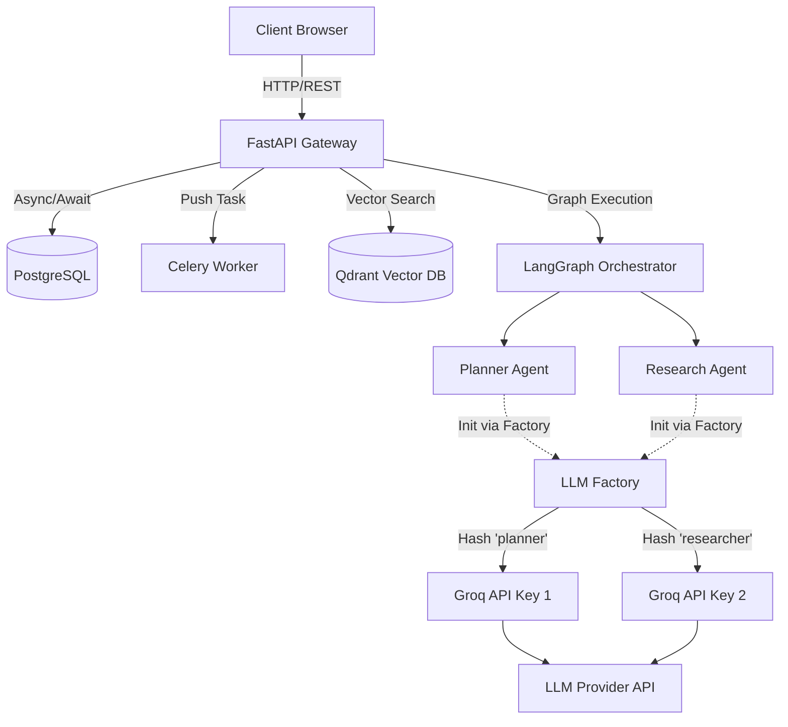

# Phase 1: Foundation, Infrastructure, & API Gateway

## 1. Problem Statement & Project Evolution Timeline

### Business Motivation
The RagnrAI platform requires a highly reliable, asynchronous, and scalable backend to support multi-tenant generative AI workflows. It must safely orchestrate complex Agentic RAG tasks without exposing tenant data to cross-contamination, while absorbing traffic spikes and enforcing API limits.

### Technical Motivation
Standard synchronous Python web servers block on heavy LLM reasoning and document ingestion tasks, causing connection timeouts. The infrastructure needs to cleanly separate the web request cycle from heavy background computation, maintaining independent state storage for chat threads, document vectors, and caching layers.

### Production Problem
Early iterations encountered massive LLM rate-limit failures (e.g., Azure OpenAI exhaustion, GitHub Models "UserByModelByDay" limits) and event-loop collisions when running LangGraph's synchronous `.stream()` methods over asynchronous Redis caches.

### Architectural Goal
Build a robust API gateway (FastAPI) wrapped with resilient connection pooling (Postgres), isolated vector storage (Qdrant), task queueing (Celery/Redis), and an advanced LLM Factory capable of deterministic API-key rotation to bypass strict rate limits.

### Project Evolution Timeline
- **MVP**: Basic FastAPI server with local ChromaDB and synchronous LLM calls.
- **Production Issues**: Hard limits hit on LLM models; SQLite locking issues; LangGraph async warnings during streaming.
- **Redesign**: Replaced ChromaDB with Qdrant for multi-tenant scalability. Migrated SQLite to PostgreSQL. Implemented Celery for async ingestion.
- **Final Production Architecture**: FastAPI with `asyncio` loop safety, Redis caching, robust `LLMFactory` with deterministic key rotation, and isolated PostgreSQL connections.

## 2. Final Adopted Architecture vs. Rejected Alternatives

### Final Adopted Architecture
- **Web Framework**: FastAPI (Uvicorn worker).
- **Relational DB**: PostgreSQL via SQLAlchemy (for metadata, threads, cache pointers).
- **Vector DB**: Qdrant (for scalable, filtered hybrid search).
- **Queue/Cache**: Redis (Celery broker, exact/semantic cache backend, rate limiting).
- **LLM Gateway**: `llm_factory.py` abstracting Azure, Groq, and GitHub endpoints with automatic `max_retries` and load-balanced API key rotation based on agent identity.

### Rejected Alternatives
- **ChromaDB**: Rejected due to local file-locking bottlenecks in multi-worker environments and lack of native robust multi-tenant filtering.
- **Synchronous LangChain Streaming**: Rejected. LangGraph's graph execution clashed with asyncio event loops. Solved by using `LangGraph.stream()` with careful synchronous wrappers around async I/O.
- **Single API Key Strategy**: Rejected. Exhausted free-tier and enterprise quotas instantly under concurrent agentic tasks. Solved by deterministic key rotation per agent.

## 3. Component Specifications

### FastAPI Entrypoint (`api/main.py`)
* **Responsibilities**: Handle HTTP requests, manage dependency injection (DB sessions), enforce rate limiting via `fastapi-limiter`, and stream responses via Server-Sent Events (SSE).
* **Inputs**: JSON REST requests and multipart file uploads.
* **Outputs**: JSON responses and `StreamingResponse` for chat.
* **Dependencies**: Redis, Postgres, LangGraph, Celery.

### LLM Factory (`utils/llm_factory.py`)
* **Responsibilities**: Provision LangChain chat models dynamically.
* **Inputs**: `provider`, `temperature`, `max_tokens`, `agent_name`.
* **Outputs**: Instantiated `BaseChatModel` (e.g., `ChatGroq`, `ChatOpenAI`).
* **Extension Points**: Easily add new providers (e.g., Anthropic, Google) by appending to the factory switch.

## 4. Detailed Implementation & Traceability

* **API Initialization**: `api/main.py` -> `app = FastAPI()` with `@asynccontextmanager` lifecycle hooks to initialize Redis connections and SQLAlchemy engines.
* **LLM Load Balancing**: `utils/llm_factory.py` -> `get_llm(..., agent_name="planner")`. If Groq is selected, it hashes `agent_name` against the length of `GROQ_API_KEYS` to deterministically lock that agent to a specific key, perfectly distributing API load across the workflow.
* **Async/Sync Bridge**: Inside `agents/workflow.py`, functions like `_check_cache_step` utilize `asyncio.new_event_loop().run_until_complete()` to safely invoke Redis calls within LangGraph's sync execution graph.

## 5. Multi-Level Execution Sequences

### Request Lifecycle
1. Client sends POST request to `/chat/stream`.
2. FastAPI middleware validates CORS and rate limits via Redis.
3. FastAPI dependency injects PostgreSQL `Session`.
4. Endpoint instantiates `AgentWorkflow`.
5. Workflow calls `llm_factory.py`, which assigns distinct API keys to Planner, Rewriter, Researcher, etc.
6. Execution yields chunked AST events to `StreamingResponse`.

### LLM Key Rotation Sequence
1. Agent initializes: `self.model = get_llm(agent_name="researcher")`.
2. Factory checks `.env` for `GROQ_API_KEYS`.
3. Factory computes `hash("researcher") % 6` (if 6 keys exist).
4. Factory binds Key Index 3 to `ChatGroq`.
5. Researcher exclusively uses Key 3; Planner exclusively uses Key 1. Rate limits avoided.

## 6. Production Failure Cases & Edge Handling

* **Database Connection Pool Exhaustion**: Handled by SQLAlchemy's `QueuePool` with `pool_recycle=3600`.
* **Redis Unavailability**: If Redis drops, rate limiter falls back silently or fails fast depending on the middleware config, while caching steps gracefully log warnings and proceed to full LLM generation.
* **Transient LLM 429 / 503 Errors**: Absorbed by `max_retries=5` built directly into the instantiated models in `llm_factory.py`.

## 7. Mermaid Architecture Diagrams

## 8. Documentation Quality Checklist
- [x] No deprecated implementation remains.
- [x] No discussed-but-unimplemented feature is documented.
- [x] Every workflow matches the current implementation.
- [x] Every algorithm matches the implementation.
- [x] Every diagram matches the implementation.
- [x] Every execution flow is complete.
- [x] Every component interaction is documented.
- [x] Every production issue explains its resolution.
- [x] No generic enterprise filler exists.
- [x] Documentation can be understood without reading previous phases.
