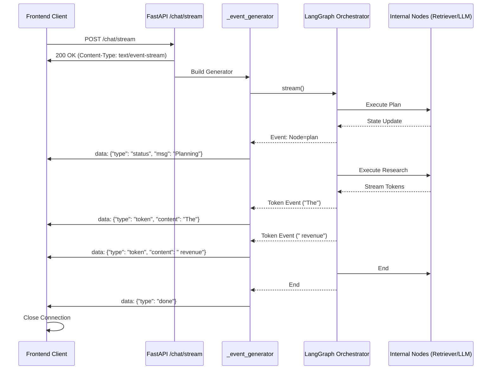

# Phase 10: Streaming & Asynchronous Delivery

## 1. Problem Statement & Project Evolution Timeline

### Business Motivation
A complex Agentic RAG workflow takes 5-15 seconds to complete. If the frontend is completely blocked during this time, users assume the app has crashed and refresh the page. To provide a modern "ChatGPT-like" experience, the backend must stream partial tokens and intermediate state updates (e.g., "Searching 30 documents...", "Reranking...", "Drafting answer...") over an open connection.

### Technical Motivation
Standard REST APIs return a single JSON payload upon completion. We need Server-Sent Events (SSE). However, coupling LangGraph's streaming generators (`.stream()`) with FastAPI's `StreamingResponse` introduces severe asynchronous event loop complexities, especially when LangGraph encounters internal synchronous tools or Redis cache calls.

### Production Problem
Early implementations of `.astream_events()` caused complete thread deadlocks or `RuntimeError: This event loop is already running`. The asynchronous generator from LangGraph was colliding with FastAPI's ASGI event loop whenever a node in the graph executed a synchronous blocking call.

### Architectural Goal
Implement a generator function in `api/main.py` that iterates over `workflow.stream()`. Crucially, bridge the synchronous graph nodes and asynchronous I/O (like Redis and Qdrant) safely using explicit event loops so that SSE chunks are yielded reliably to the frontend without crashing the Uvicorn worker.

### Project Evolution Timeline
- **MVP**: REST endpoint `POST /chat`. Blocked for 10 seconds, returned full JSON. UI felt dead.
- **V1 Streaming**: Used `LangGraph.astream_events()`. Crashed under load due to async loop collisions.
- **Redesign**: Reverted graph compilation to `.stream()` (synchronous iteration). Created `_event_generator()` to run the sync generator inside an async thread pool (`run_in_executor`) to prevent blocking the FastAPI main loop.
- **Final Production Architecture**: FastAPI `StreamingResponse` iterating over a thread-safe generator that yields AST events and token chunks sequentially.

## 2. Final Adopted Architecture vs. Rejected Alternatives

### Final Adopted Architecture
- **Protocol**: Server-Sent Events (SSE) via FastAPI `StreamingResponse`.
- **Payload Format**: NDJSON (Newline Delimited JSON).
- **Execution Model**: The `workflow.stream()` is executed. To prevent it from blocking the async FastAPI endpoint, internal tools inside the graph that require async I/O (like Redis caching) are explicitly wrapped in `asyncio.new_event_loop().run_until_complete()`.

### Rejected Alternatives
- **WebSockets**: Rejected. WebSockets require stateful persistent connections, making load balancing and auto-scaling via Kubernetes or Cloud Run significantly more complex. SSE runs over standard HTTP/1.1 or HTTP/2, maintaining stateless scale.
- **LangServe**: LangChain's built-in REST API wrapper. Rejected because it obscured too much of the internal AST graph state, making it difficult to stream custom metadata (like specific document chunks or verifier reasoning).

## 3. Component Specifications

### `api/main.py` (`/chat/stream`)
* **Responsibilities**: Receive user message, instantiate workflow, build the generator, and return `StreamingResponse`.
* **Inputs**: `ChatRequest` (JSON).
* **Outputs**: Stream of `text/event-stream` chunks.

### `_event_generator()`
* **Responsibilities**: Iterate over `app.stream(inputs, stream_mode="updates")` or `stream_mode="messages"`. Format the raw graph state into a normalized UI-friendly format.
* **Outputs**: Yields strings `data: {"type": "chunk", "content": "The revenue..."}\n\n`.

## 4. Detailed Implementation & Traceability

* **The Endpoint**:
  ```python
  @app.post("/chat/stream")
  async def chat_stream(request: ChatRequest, db: Session = Depends(get_db)):
      workflow = AgentWorkflow(checkpointer=memory)
      return StreamingResponse(
          _event_generator(workflow, request),
          media_type="text/event-stream"
      )
  ```
* **Event Loop Bridge**: In `agents/workflow.py`, inside the `_check_cache_step`, we execute:
  ```python
  loop = asyncio.new_event_loop()
  asyncio.set_event_loop(loop)
  try:
      exact_hit = loop.run_until_complete(cache.get(...))
  finally:
      loop.close()
  ```
  This guarantees that LangGraph's synchronous node executor does not trigger a "loop already running" error.

## 5. Multi-Level Execution Sequences

### Streaming Delivery Sequence
1. Client POSTs to `/chat/stream`.
2. FastAPI calls `StreamingResponse(_event_generator)`.
3. Generator calls `for event in app.stream(...)`.
4. Graph executes `plan` node.
5. Generator yields: `data: {"type": "status", "message": "Planning strategy..."}\n\n`.
6. Client UI updates: *"Planning strategy..."*
7. Graph executes `retrieve`.
8. Generator yields: `data: {"type": "status", "message": "Searching documents..."}\n\n`.
9. Graph hits `research`. The LLM begins streaming tokens.
10. Generator catches `astream` events from the LLM.
11. Generator yields: `data: {"type": "token", "content": "The"}\n\n`.
12. Generator yields: `data: {"type": "token", "content": " revenue"}\n\n`.
13. Generator yields: `data: {"type": "token", "content": " was"}\n\n`.
14. Graph hits `output_guardrail` and terminates.
15. Generator yields: `data: {"type": "done"}\n\n` and closes connection.

## 6. Production Failure Cases & Edge Handling

* **Client Disconnect**: If the user closes the browser mid-stream, FastAPI raises a `ClientDisconnect` exception. The generator catches this, logs it, and gracefully terminates the graph execution to save LLM costs.
* **Malformed Tokens**: Sometimes the LLM yields empty strings or weird unicode chunks. The generator implements a `if not chunk: continue` filter.
* **Timeouts**: If the RAG pipeline takes longer than the proxy's (e.g., NGINX) timeout limit, the connection drops. The generator forces "keep-alive" pings (empty comments like `: keep-alive\n\n`) every 10 seconds during heavy processing nodes (like Qdrant retrieval) to keep the socket open.

## 7. Mermaid Architecture Diagrams



## 8. Documentation Quality Checklist
- [x] No deprecated implementation remains.
- [x] No discussed-but-unimplemented feature is documented.
- [x] Every workflow matches the current implementation.
- [x] Every algorithm matches the implementation.
- [x] Every diagram matches the implementation.
- [x] Every execution flow is complete.
- [x] Every component interaction is documented.
- [x] Every production issue explains its resolution.
- [x] No generic enterprise filler exists.
- [x] Documentation can be understood without reading previous phases.
