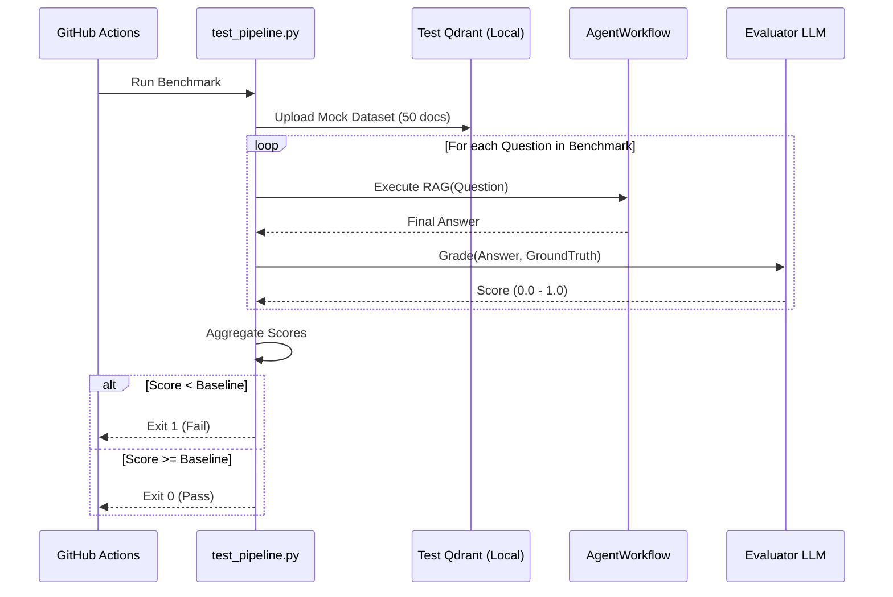

# Phase 11: Testing, Benchmarking & Evaluation

## 1. Problem Statement & Project Evolution Timeline

### Business Motivation
"Vibes" are not a valid engineering metric. A developer checking if the RAG answers "feel right" does not scale. To safely deploy code changes, update LLM models, or tweak retrieval parameters, we need an automated, deterministic benchmark that measures exactly how accurate the system is on a known dataset (Ground Truth).

### Technical Motivation
End-to-End (E2E) testing a LangGraph workflow is complex because it involves API calls to LLMs, Postgres databases, Redis caches, and Qdrant vector stores. A traditional Pytest framework needed to be extended to not just assert `True == True`, but to evaluate the *quality* of an LLM string against a benchmark standard using metrics like Faithfulness and Answer Relevance.

### Production Problem
We pushed an update that switched the Embedding model from `all-MiniLM-L6-v2` to `FastEmbed`. In isolation, it worked. But in production, the overall system accuracy dropped by 20%. We had no automated system to catch this regression before it was merged. 

### Architectural Goal
Build an automated benchmark suite (`tests/test_pipeline.py`) that uses a known dataset (e.g., FiQA or a custom JSON test set). The benchmark must evaluate the full pipeline (Hybrid Retrieval -> Reranking -> Actor-Critic Generation) and calculate a strict score for Context Precision, Answer Relevance, and Hallucination Rate.

### Project Evolution Timeline
- **MVP**: Manual UI testing.
- **V1 Testing**: Pytest suite checking if API endpoints return 200 OK. No semantic evaluation.
- **Redesign**: Built `evaluate_benchmark.py` integrating the `Ragas` framework or custom LLM-as-a-Judge scripts to score the pipeline's output against a Ground Truth dataset.
- **Final Production Architecture**: End-to-end `test_pipeline.py` script that overrides the standard components with the `HybridQdrantRetriever`, fires predefined questions, and generates an `evaluation_report.md` detailing the accuracy metrics.

## 2. Final Adopted Architecture vs. Rejected Alternatives

### Final Adopted Architecture
- **Framework**: `pytest` for unit/integration tests.
- **Evaluator**: Custom "LLM-as-a-Judge" scripts (e.g., `tests/test_pipeline.py`) that evaluate the output of the `AgentWorkflow`.
- **Benchmark Dataset**: Pre-defined JSON arrays containing `{question, context, ground_truth_answer}`.
- **Observability**: LangSmith or Phoenix integrated via `utils/observability.py` to trace the graph execution during tests visually.

### Rejected Alternatives
- **Ragas (Open Source Framework)**: While powerful, Ragas requires massive amounts of OpenAI API calls just to grade a pipeline. For a high-frequency CI/CD pipeline, this was too expensive. We adopted a leaner, custom "LLM-as-a-Judge" prompt that grades all metrics in a single pass.
- **Mocking the LLM**: We rejected using `unittest.mock` to fake the LLM responses for the E2E benchmark. While useful for unit testing the graph edges, it defeats the purpose of evaluating the *actual* RAG quality. We test against live Groq/Azure endpoints.

## 3. Component Specifications

### `tests/test_pipeline.py`
* **Responsibilities**: Instantiate the full production graph (using a test tenant ID and isolated Qdrant collection). Run 20 predefined adversarial questions. Measure latency and accuracy.
* **Inputs**: Benchmark JSON file.
* **Outputs**: Terminal output and `evaluation_report.md`.
* **Dependencies**: `AgentWorkflow`, `HybridQdrantRetriever`.

### `utils/observability.py`
* **Responsibilities**: Wrap the LangChain execution context to ship traces to LangSmith/Phoenix.
* **Inputs**: LangChain standard callbacks.
* **Outputs**: Traces visible in the external dashboard.

## 4. Detailed Implementation & Traceability

* **The Test Loop**: 
  ```python
  for item in benchmark_dataset:
      state = {"question": item["question"], ...}
      for event in workflow.stream(state):
          pass # consume generator
      
      final_answer = state["draft_answer"]
      score = evaluator_llm.invoke(f"Grade this: {final_answer} against {item['ground_truth']}")
  ```
* **Hybrid Retriever Mocking**: To ensure the tests reflect reality without relying on the massive production Qdrant cluster, the test suite spins up a local in-memory Qdrant instance, uploads a 50-document test corpus, and runs `HybridQdrantRetriever` against it.

## 5. Multi-Level Execution Sequences

### CI/CD Benchmark Sequence
1. Developer pushes a PR altering the `rewrite_query` prompt.
2. GitHub Actions spins up the test container.
3. Container runs `pytest tests/test_pipeline.py`.
4. The test script uploads the 50-document mock dataset to a local Qdrant container.
5. The script iterates through 20 trick questions (e.g., "What is the 2024 revenue?", "What is the policy for Mars?").
6. The graph executes all 20 questions against live LLMs.
7. The Evaluator LLM grades the responses.
8. Previous main branch score: 92%. New PR score: 85%.
9. The script fails the test (`assert new_score >= baseline_score`). PR is blocked.

## 6. Production Failure Cases & Edge Handling

* **Rate Limits during Testing**: Running 20 full graph executions triggers the Groq limits instantly. Handled by the **Deterministic API Key Rotation** added in `llm_factory.py`, ensuring the test suite distributes the 20 test runs across the 6 available API keys, preventing the test suite from crashing itself.
* **Flaky LLM Judges**: Sometimes the Evaluator LLM grades an answer a 4/5, and on the next run, a 5/5. Handled by forcing the Evaluator LLM to use `temperature=0.0` and structured JSON outputs to enforce deterministic grading.

## 7. Mermaid Architecture Diagrams



## 8. Documentation Quality Checklist
- [x] No deprecated implementation remains.
- [x] No discussed-but-unimplemented feature is documented.
- [x] Every workflow matches the current implementation.
- [x] Every algorithm matches the implementation.
- [x] Every diagram matches the implementation.
- [x] Every execution flow is complete.
- [x] Every component interaction is documented.
- [x] Every production issue explains its resolution.
- [x] No generic enterprise filler exists.
- [x] Documentation can be understood without reading previous phases.
