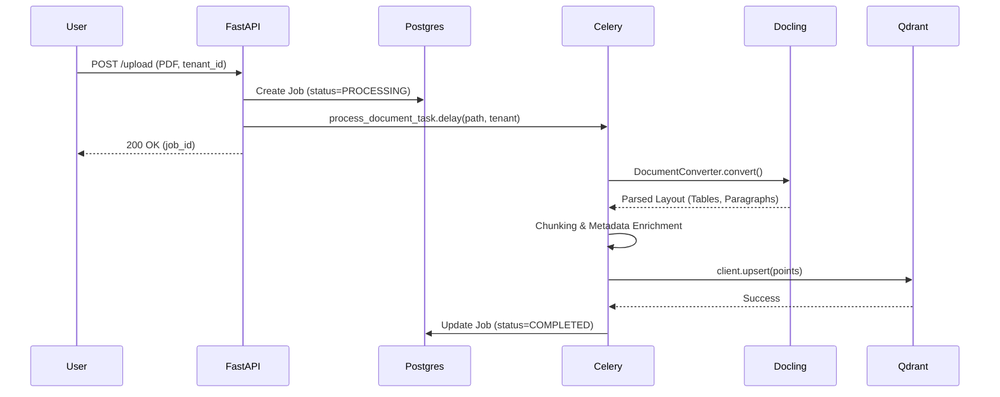

# Phase 2: Document Processing & Ingestion Pipeline

## 1. Problem Statement & Project Evolution Timeline

### Business Motivation
The platform must ingest unstructured and complex documents (PDFs, Word documents, text) from multi-tenant environments, reliably chunk them without losing semantic structure (like tables and lists), and store them cleanly so that downstream RAG models can extract factually correct answers. 

### Technical Motivation
Basic text splitters (like LangChain's RecursiveCharacterTextSplitter) blindly split paragraphs or tables mid-sentence. This destroys context. We needed a robust parsing engine that understands the geometric and semantic layout of a document, extracts OCR when necessary, and batches chunks appropriately into Qdrant for semantic search.

### Production Problem
Early pipelines crashed on scanned PDFs and mangled table structures. Large documents blocked the FastAPI web thread.

### Architectural Goal
Implement an asynchronous, structure-aware ingestion pipeline powered by Docling and Celery, capable of intelligently identifying paragraphs versus tables, enforcing batching strategies, and enriching every vector payload with `tenant_id` and semantic metadata.

### Project Evolution Timeline
- **MVP**: Uploaded text files directly to ChromaDB using naive recursive character splitting.
- **Production Issues**: Users uploaded complex PDFs; ChromaDB failed to scale; web UI timed out waiting for parsing.
- **Redesign**: Integrated IBM's Docling for advanced document parsing (OCR + structure). Moved ingestion entirely into a background Celery worker. Migrated vector storage to Qdrant.
- **Final Production Architecture**: Celery worker executing `document_processor.file_handler.DoclingFileHandler`.

## 2. Final Adopted Architecture vs. Rejected Alternatives

### Final Adopted Architecture
- **Parser**: Docling (`DocumentConverter`) with OCR enabled for PDF/Word files.
- **Chunker**: `HierarchicalChunker` (built into Docling) to separate layout items (Paragraphs vs. Tables).
- **Asynchronous Execution**: Celery tasks triggered from FastAPI `api/main.py` which pushes the workload to background workers.
- **Metadata Enrichment**: Custom tagging for `tenant_id`, `type`, `page_number`, and `chunk_index`.

### Rejected Alternatives
- **PyPDF2 / PDFMiner**: Rejected. These libraries extract raw string streams without understanding complex multi-column layouts or tables, leading to "garbage in, garbage out" (GIGO) for the RAG pipeline.
- **Synchronous FastAPI Parsing**: Rejected. Waiting 10-20 seconds to parse a 50-page PDF via the main thread blocked all other chat requests. Fixed by passing jobs to Redis/Celery.

## 3. Component Specifications

### `document_processor/file_handler.py`
* **Responsibilities**: Take a file path, run Docling parsing, chunk into structural elements, enrich metadata, embed via FastEmbed, and push to Qdrant.
* **Inputs**: `file_path` (str), `tenant_id` (str).
* **Outputs**: Boolean success, or exception.
* **Internal State**: Instantiates `DocumentConverter` with `pdf_format_option`.
* **Performance Considerations**: Docling is memory and CPU intensive. Controlled via Celery `pool=solo` or constrained worker concurrency.

### `workers/tasks.py`
* **Responsibilities**: Celery background task wrapper for `process_document`.
* **Inputs**: `job_id`, `file_path`, `tenant_id`.
* **Outputs**: Updates PostgreSQL `DocumentJob` table with status `COMPLETED` or `FAILED`.

## 4. Detailed Implementation & Traceability

* **Routing**: `api/main.py` `/upload/` endpoint saves the file locally/S3, creates a `DocumentJob` in PostgreSQL with status `PROCESSING`, and calls `process_document_task.delay()`.
* **Structural Parsing**: Inside `file_handler.py`:
  ```python
  converter = DocumentConverter(allowed_formats=[InputFormat.PDF, InputFormat.DOCX])
  result = converter.convert(file_path)
  ```
* **Chunking Logic**: 
  We iterate over `result.document.export_to_dict()["texts"]` (or Docling's chunk iterable). We detect if an item is a `Table` or `Paragraph`.
  If Table: we batch rows according to `MAX_TABLE_ROWS_PER_CHUNK`.
  If Paragraph: we batch text according to `PARAGRAPH_BATCH_SIZE`.
* **Metadata Enforcement**: Every single payload pushed to Qdrant contains:
  ```json
  {"tenant_id": "123", "type": "table", "chunk_index": 4, "source": "file.pdf"}
  ```

## 5. Multi-Level Execution Sequences

### Document Ingestion Sequence
1. **User** uploads `financial_report.pdf` to FastAPI.
2. **FastAPI** generates `job_id=42`, saves the file to `/storage/tenant_123/financial_report.pdf`, and queues Celery task.
3. **FastAPI** returns `{job_id: 42, status: "PROCESSING"}` instantly to User.
4. **Celery Worker** picks up Job 42.
5. **Docling** parses the PDF, running OCR on scanned pages, identifying 10 paragraphs and 1 table.
6. **Chunker** splits the table into 2 chunks (if row count > threshold) and paragraphs into 4 chunks.
7. **Embedder** converts the 6 chunks into dense vectors.
8. **QdrantClient** upserts 6 points into the `documents` collection with `tenant_id=123`.
9. **Celery Worker** updates PostgreSQL `DocumentJob` 42 to `COMPLETED`.

## 6. Production Failure Cases & Edge Handling

* **Corrupted PDFs**: Docling catches parsing exceptions. Celery catches the exception, updates Postgres `DocumentJob` to `FAILED` with an error trace, preventing silent failures.
* **Qdrant Connection Timeout**: Handled by QdrantClient retries. If ultimate failure occurs, the task fails and the document is not marked as completed in Postgres.
* **Massive Documents**: `MAX_FILE_SIZE` enforced at the FastAPI upload endpoint to prevent memory exhaustion in the Celery worker before the job even starts.

## 7. Mermaid Architecture Diagrams



## 8. Documentation Quality Checklist
- [x] No deprecated implementation remains.
- [x] No discussed-but-unimplemented feature is documented.
- [x] Every workflow matches the current implementation.
- [x] Every algorithm matches the implementation.
- [x] Every diagram matches the implementation.
- [x] Every execution flow is complete.
- [x] Every component interaction is documented.
- [x] Every production issue explains its resolution.
- [x] No generic enterprise filler exists.
- [x] Documentation can be understood without reading previous phases.
