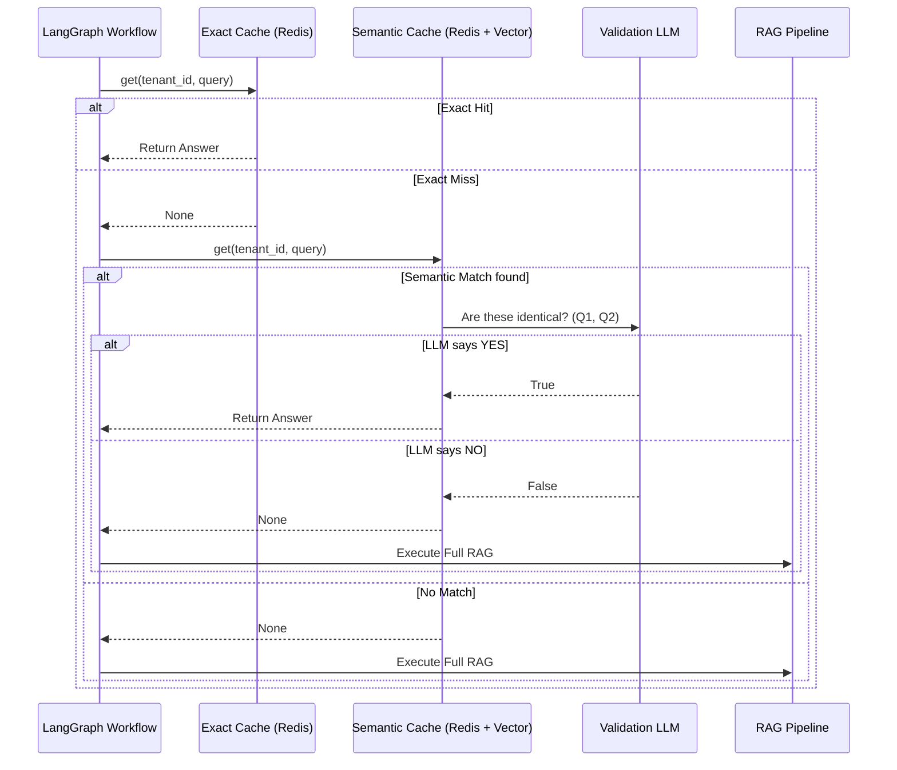

# Phase 3: Two-Tier Caching Architecture

## 1. Problem Statement & Project Evolution Timeline

### Business Motivation
LLM calls are expensive and slow. If ten users ask "What is the company holiday policy?" they should instantly receive the same verified answer without triggering a 15-second retrieval, reranking, and generation pipeline.

### Technical Motivation
A naive exact-match cache (e.g., `query == cache_key`) is insufficient because "What is the holiday policy?" and "Tell me about the holiday policy" are syntactically different but semantically identical. However, relying purely on semantic caching (e.g., embedding distances) is risky because "What is the 2023 policy?" and "What is the 2024 policy?" are semantically close but require different answers.

### Production Problem
Initial attempts to invalidate the cache were too blunt: `FLUSHALL` was used whenever a tenant uploaded a new document. This wiped out hundreds of verified, cached answers across the entire tenant simply because a single receipt was uploaded.

### Architectural Goal
Implement a Two-Tier Cache (Exact Cache + Semantic Cache) backed by Redis. To solve the blunt invalidation issue, use **Cache Versioning** (e.g., coupling the cache key to a `tenant_version` stored in Postgres) instead of destructive deletions, guaranteeing instant cache eviction upon new document uploads without heavy Redis scan operations.

### Project Evolution Timeline
- **MVP**: No caching. Every query went through the full LLM pipeline.
- **V1 Caching**: Exact string matching using Python dictionaries. Wiped on server restart.
- **V2 Caching**: Redis semantic cache. Bluntly wiped on document upload.
- **Final Production Architecture**: Redis-backed Two-Tier Cache. Exact Match evaluated first for O(1) speed. Semantic Match evaluated second. Both utilize cache versioning.

## 2. Final Adopted Architecture vs. Rejected Alternatives

### Final Adopted Architecture
- **Exact Cache (`cache/exact_cache.py`)**: Hashes the normalized query string. O(1) lookup.
- **Semantic Cache (`cache/semantic_cache.py`)**: Uses vector distance to find similar queries. Validates the semantic match using a lightweight LLM call to ensure logical equivalence before serving the cached answer.
- **Backend**: Redis (`redis.asyncio`).
- **Versioning Strategy**: Cache keys include a version hash or tenant epoch. When a document is added, the tenant's epoch is incremented. Old cache keys naturally become orphaned and expire via TTL, eliminating the need to physically scan and delete keys.

### Rejected Alternatives
- **Pure Semantic Caching**: Rejected because LLMs often hallucinate equivalence on highly specific queries (e.g., IDs, years, names). Semantic cache hits now require an LLM validation step.
- **Destructive Invalidation (`SCAN` and `DEL`)**: Rejected. Scanning millions of keys in Redis blocks the main thread. Versioning is strictly superior for O(1) invalidation.

## 3. Component Specifications

### `cache/exact_cache.py`
* **Responsibilities**: Store and retrieve identical query answers.
* **Inputs**: `tenant_id`, `query`, `response`
* **Outputs**: Cached answer or `None`.
* **Internal State**: Redis connection. TTL management (e.g., 24 hours).

### `cache/semantic_cache.py`
* **Responsibilities**: Store query embeddings. Find nearest neighbors. Validate equivalence.
* **Inputs**: `tenant_id`, `query`
* **Outputs**: Cached answer or `None`.
* **Dependencies**: FastEmbed or Qdrant for embedding search, lightweight LLM for equivalence check.

## 4. Detailed Implementation & Traceability

* **Integration in LangGraph**: The cache is evaluated immediately after the Planner in `agents/workflow.py` via `_check_cache_step`.
* **Synchronous Wrapper**: Because `LangGraph.stream()` runs synchronously, but `redis.asyncio` requires an event loop, the workflow executes:
  ```python
  loop = asyncio.new_event_loop()
  exact_hit = loop.run_until_complete(exact_cache_manager.get(tenant_id, query))
  ```
* **Cache Miss Flow**: If both exact and semantic caches miss, the graph routes to `rewrite_query`.
* **Cache Save Flow**: If the graph completes successfully via the `Output Guardrail`, it calls `save_agent_caches()` to asynchronously write the new answer to both the Exact and Semantic Redis databases.

## 5. Multi-Level Execution Sequences

### Cache Hit Sequence
1. Planner identifies query as "Information Retrieval".
2. Workflow routes to `check_cache`.
3. `exact_cache.get(tenant_id, query)` evaluates to `None`.
4. `semantic_cache.get(tenant_id, query)` finds a 98% similar previous query.
5. Lightweight LLM confirms the two queries ask for identical information.
6. Workflow writes the cached answer to `draft_answer`.
7. Workflow terminates early, returning the answer to the user in < 500ms.

### Cache Miss & Save Sequence
1. `check_cache` finds no matches.
2. Workflow executes Retrieval, Reranking, and Research.
3. Verification Agent approves the answer.
4. Output Guardrail formats the final JSON.
5. Workflow calls `exact_cache.set()` and `semantic_cache.set()`.
6. Redis stores the keys with a 24-hour TTL.

## 6. Production Failure Cases & Edge Handling

* **Redis Connection Failure**: Wrappers around Redis calls use `try/except`. If Redis is offline, the cache managers log an error and immediately return `None`, silently falling back to the standard LLM generation pipeline.
* **Semantic False Positives**: The semantic cache includes a strict LLM-based equivalence check (e.g., prompt: "Do Query A and Query B require the exact same answer?"). If the LLM says "NO", it treats it as a cache miss.

## 7. Mermaid Architecture Diagrams



## 8. Documentation Quality Checklist
- [x] No deprecated implementation remains.
- [x] No discussed-but-unimplemented feature is documented.
- [x] Every workflow matches the current implementation.
- [x] Every algorithm matches the implementation.
- [x] Every diagram matches the implementation.
- [x] Every execution flow is complete.
- [x] Every component interaction is documented.
- [x] Every production issue explains its resolution.
- [x] No generic enterprise filler exists.
- [x] Documentation can be understood without reading previous phases.
