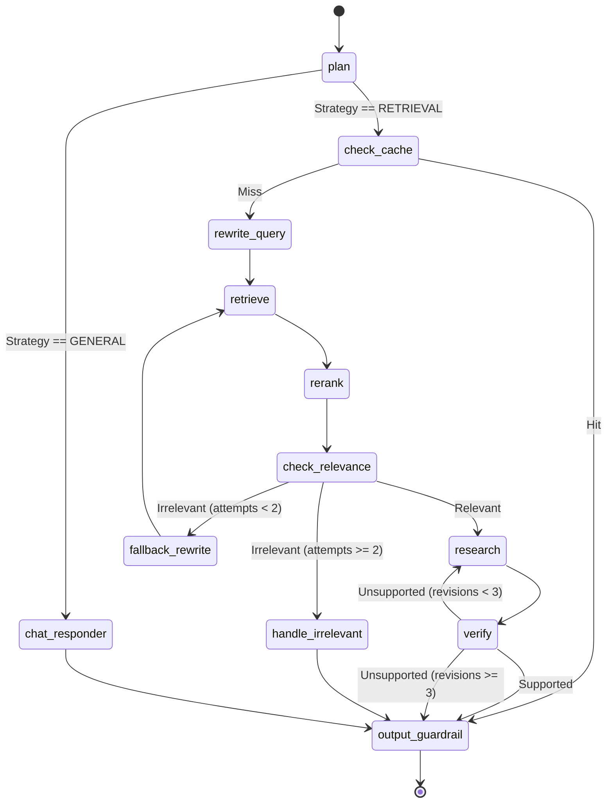

# Phase 4: State Graph & Workflow Orchestrator

## 1. Problem Statement & Project Evolution Timeline

### Business Motivation
Agentic RAG workflows require strict control. A hallucinating agent or an infinite retry loop can result in massive API costs and delayed responses to the user. The platform requires a definitive, trackable, and interruptible state machine to govern the execution lifecycle from Planning through Verification.

### Technical Motivation
Executing a linear script (`planner() -> retrieve() -> research() -> verify()`) is brittle. If retrieval fails, the script must elegantly back out or retry. Passing local variables between massive nested functions causes "state leakage", where context from a failed retry pollutes the next attempt. We need a definitive `StateGraph` that isolates node inputs and outputs.

### Production Problem
Our initial Python loop-based orchestration encountered "silent fallbacks", where the Retriever returned 0 documents but the Researcher still attempted to answer the question using its latent knowledge, hallucinating facts. 

### Architectural Goal
Adopt `LangGraph` to build a Directed Acyclic Graph (DAG) for the orchestration. This explicitly maps nodes (Agents/Functions) and edges (Conditional Routing), passing an immutable `AgentState` `TypedDict` between steps to guarantee no state leakage.

### Project Evolution Timeline
- **MVP**: Linear Python script chaining LLM chains together. Failed on missing context.
- **V1 Orchestrator**: Hardcoded Python `while` loop for retries. Caused infinite loops when the query was completely irrelevant to the database.
- **Redesign**: LangGraph adoption. Created `AgentState` schema. Mapped 12 distinct nodes.
- **Final Production Architecture**: LangGraph StateGraph with conditional edges handling Cache Hits, General Chat routing, Relevance failures, and Verification rejections.

## 2. Final Adopted Architecture vs. Rejected Alternatives

### Final Adopted Architecture
- **Engine**: LangGraph `StateGraph`.
- **State Schema**: `AgentState` (TypedDict holding `question`, `draft_answer`, `documents`, `retrieval_queries`, `failure_reason`, `revision_count`, etc.).
- **Checkpointing**: PostgresSaver (LangGraph's native checkpointer) for persistence across threads.
- **Nodes**: `plan`, `chat_responder`, `rewrite_query`, `check_cache`, `retrieve`, `rerank`, `check_relevance`, `fallback_rewrite`, `handle_irrelevant`, `research`, `verify`, `output_guardrail`.

### Rejected Alternatives
- **AutoGPT / BabyAGI (Autonomous Agents)**: Rejected. Autonomous "ReAct" loops are too unpredictable for enterprise RAG. They waste tokens planning unnecessary steps. We strictly enforce the workflow topology.
- **Celery Canvas (Chords/Chains)**: Celery is excellent for async background document ingestion but too slow and heavy for real-time streaming conversational graphs.

## 3. Component Specifications

### `agents/workflow.py` (`AgentWorkflow`)
* **Responsibilities**: Define the nodes, edges, and compile the application graph. Manage the Postgres checkpointer. Stream events back to FastAPI.
* **Inputs**: `thread_id`, `tenant_id`, `question`, `chat_history`.
* **Outputs**: AST streaming events yielding `draft_answer` tokens or final JSON payloads.
* **Internal State**: The compiled `StateGraph` object.

### `AgentState` (`TypedDict`)
* **Responsibilities**: Act as the single source of truth for the data passed between nodes.
* **Fields**:
  - `question`: Original user input.
  - `retrieval_queries`: List of rewritten queries.
  - `documents`: List of retrieved `Document` objects.
  - `draft_answer`: The researcher's generated response.
  - `revision_count` / `retrieval_attempts`: Safety counters for loop prevention.

## 4. Detailed Implementation & Traceability

* **Initialization**: `api/main.py` creates a Postgres checkpointer, passing it to `AgentWorkflow(checkpointer=memory)`.
* **Node Definition**: Every step (e.g., `_retrieve_step`) takes `state: AgentState` and returns a dict mapping to the state fields it updates (e.g., `{"documents": docs}`).
* **Conditional Edges**: 
  - `plan` -> Conditional route to `chat_responder` OR `check_cache`.
  - `check_cache` -> Conditional route to `output_guardrail` (on hit) OR `rewrite_query` (on miss).
  - `check_relevance` -> Conditional route to `research` (if YES) OR `fallback_rewrite` (if NO).

## 5. Multi-Level Execution Sequences

### Standard RAG Path
1. `plan` determines strategy is Information Retrieval.
2. `check_cache` misses.
3. `rewrite_query` generates 3 search vectors.
4. `retrieve` fetches 30 documents from Qdrant.
5. `rerank` filters down to 6 documents using FlashRank.
6. `check_relevance` validates documents against query (Returns YES).
7. `research` synthesizes `draft_answer`.
8. `verify` confirms `draft_answer` is grounded in context (Returns YES).
9. `output_guardrail` formats the final JSON.

### Relevance Failure Path
1. `check_relevance` determines all retrieved chunks are irrelevant (Returns NO).
2. Routing edge evaluates `state["retrieval_attempts"] < 2`.
3. Routes to `fallback_rewrite`.
4. `fallback_rewrite` expands the search terms and routes back to `retrieve`.
5. If it fails again, routes to `handle_irrelevant` to safely inform the user without hallucinating.

## 6. Production Failure Cases & Edge Handling

* **Infinite Loops**: Graph routing is inherently dangerous. If the `fallback_rewrite` keeps failing, it could loop forever. Solved by incrementing `state["retrieval_attempts"]` and forcing a hard transition to `handle_irrelevant` if `attempts >= 2`.
* **Verification Loops**: If `verify` rejects the `draft_answer`, it increments `state["revision_count"]` and routes back to `research`. If `revision_count >= 3`, it routes to `output_guardrail` anyway but flags the response with a low confidence warning.

## 7. Mermaid Architecture Diagrams

## 8. Documentation Quality Checklist
- [x] No deprecated implementation remains.
- [x] No discussed-but-unimplemented feature is documented.
- [x] Every workflow matches the current implementation.
- [x] Every algorithm matches the implementation.
- [x] Every diagram matches the implementation.
- [x] Every execution flow is complete.
- [x] Every component interaction is documented.
- [x] Every production issue explains its resolution.
- [x] No generic enterprise filler exists.
- [x] Documentation can be understood without reading previous phases.
