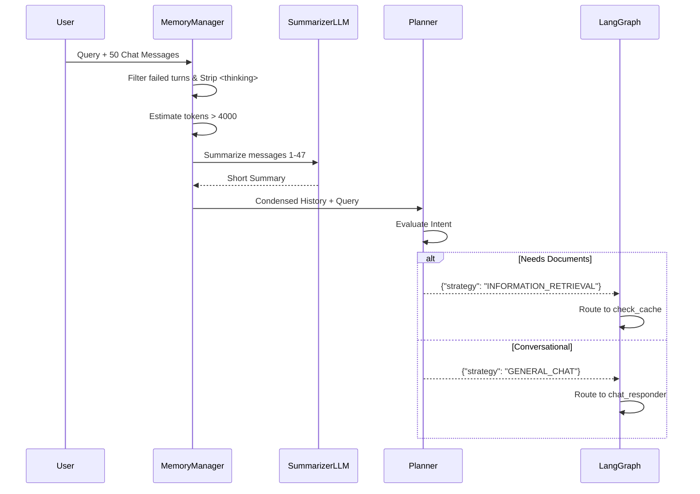

# Phase 5: Workflow Planner & Conversational Memory

## 1. Problem Statement & Project Evolution Timeline

### Business Motivation
A naive RAG pipeline executes expensive vector searches for every user message. If a user says "Hello" or "Thanks," triggering a database scan and complex document synthesis wastes time, API quotas, and creates poor user experiences. The system needs a "brain" to classify user intent and a robust memory system to maintain conversational context without blowing up the LLM token limits.

### Technical Motivation
Standard LangChain memory blindly appends messages to a list. Over a long conversation, the token window fills up, resulting in 400 Bad Request errors or massive latency spikes. Additionally, we need a lightweight, ultra-fast routing node to decide if a query is a standard chat or a document retrieval task, passing the compressed conversational context forward.

### Production Problem
Early versions of RagnrAI would literally search the database for "Thanks!", find irrelevant chunks like "Thank you for reading the 2023 financial report", and output "According to the financial report, thank you." This was completely unacceptable. Furthermore, memory bounds were breached rapidly.

### Architectural Goal
Build a `WorkflowPlanner` agent acting as the Graph entrypoint that enforces strict JSON routing decisions. Concurrently, build a `memory_manager` that tracks token usage and dynamically compresses old chat history via LLM summarization, keeping only the most recent interactions intact.

### Project Evolution Timeline
- **MVP**: No planner. Every message went to Retriever. Unbounded chat history array.
- **V1 Planner**: Zero-shot prompt asking "Is this a chat?". Often hallucinated or failed to return valid JSON. Memory still unbounded.
- **Redesign**: Bound the LLM output to a strict Pydantic JSON schema. Implemented `utils/memory.py` with `MAX_MEMORY_TOKENS`.
- **Final Production Architecture**: The Planner enforces schema-bound JSON decisions. The memory system filters out failed internal turns and uses an Azure-backed zero-temperature LLM to recursively condense history when it breaches 4000 tokens.

## 2. Final Adopted Architecture vs. Rejected Alternatives

### Final Adopted Architecture
- **Planner Agent (`agents/planner.py`)**: Uses an LLM constrained to output `{"strategy": "INFORMATION_RETRIEVAL" | "GENERAL_CHAT"}`.
- **Memory Compression (`utils/memory.py`)**: A dedicated class that estimates tokens (`len(text)//4`). If `total_tokens > MAX_MEMORY_TOKENS`, it takes `messages[:-3]`, summarizes them with an LLM, and reconstructs the array as `[Summary, Message -2, Message -1, Message 0]`.
- **Reasoning Sanitization**: Internal `<thinking>` tags generated by downstream agents are stripped by the memory manager using regex before appending to history, preventing "context pollution".

### Rejected Alternatives
- **Regex-based Planning**: Rejected. Users say things like "I want to chat about the financial report". Simple keyword routing fails to grasp complex semantic intent.
- **Sliding Window Memory**: Discarding old messages entirely (e.g., keeping only the last 10) causes the agent to suffer from amnesia regarding core topics discussed earlier. Summarization is far superior.

## 3. Component Specifications

### `WorkflowPlanner` (`agents/planner.py`)
* **Responsibilities**: Analyze the user's question alongside the active context to determine if external document retrieval is necessary.
* **Inputs**: `question`, `chat_history`, `attached_document_ids`.
* **Outputs**: `PlannerDecision` (JSON dictionary with `strategy`).
* **Dependencies**: LLM Factory (deterministically assigned key 1).

### `MemoryManager` (`utils/memory.py`)
* **Responsibilities**: Estimate tokens, strip reasoning blocks, filter out failed turns, and summarize history dynamically.
* **Inputs**: List of `ChatMessage` objects from Postgres.
* **Outputs**: A single highly compressed string representing the semantic state of the conversation.
* **Internal State**: Constant `MAX_MEMORY_TOKENS=4000`.

## 4. Detailed Implementation & Traceability

* **Initialization**: The `api/main.py` endpoint retrieves thread history from Postgres and passes it immediately to `memory_manager.compress_history(messages)`.
* **Sanitization**: Inside `compress_history`, it calls `strip_reasoning()` which executes `re.sub(r'<thinking>.*?</thinking>', '', text, flags=re.DOTALL)`.
* **Planning**: The compressed history and user question are passed into `WorkflowPlanner.plan()`. The LLM is forced via `.bind(response_format={"type": "json_object"})` to return a deterministic strategy.
* **Failed Turn Skipping**: `MemoryManager._is_failed_turn()` checks `msg.metadata_json.get("status") == "no_answer"`. If true, the memory manager completely ignores that turn during summarization so the LLM doesn't get confused by its own previous failures.

## 5. Multi-Level Execution Sequences

### Memory Compression Sequence
1. Postgres returns 50 `ChatMessage` rows for Thread 99.
2. `memory_manager` strips `<thinking>` tags from all assistant replies.
3. `memory_manager` filters out 2 turns marked `no_answer`.
4. `estimate_tokens` calculates 6,500 tokens (Breaches 4,000 threshold).
5. Manager splits: Old = messages[0:45], New = messages[45:48].
6. LLM summarizes Old messages into a 500-token summary paragraph.
7. Manager constructs final string: `--- Summary --- \n [Summary] \n --- Recent --- \n [Messages 45, 46, 47]`.

### Planner Sequence
1. Planner receives the compressed history and the new user question "What about the 2024 report?".
2. Planner LLM evaluates intent.
3. Planner returns `{"strategy": "INFORMATION_RETRIEVAL"}`.
4. LangGraph orchestrator intercepts this state change.
5. Edge routing: `if strategy == "INFORMATION_RETRIEVAL": return "check_cache"`.

## 6. Production Failure Cases & Edge Handling

* **Planner JSON Failures**: Handled natively by LangChain's JSON binding. If the LLM still returns broken JSON, a `try/except` block catches `json.JSONDecodeError` and defaults safely to `INFORMATION_RETRIEVAL`.
* **Token Estimation Inaccuracy**: Division by 4 is a rough heuristic. To prevent edge cases where actual tokens exceed context windows, the summarization LLM is given a generous buffer by setting the threshold artificially low (4000) compared to actual context limits (e.g., 8192 or 128k).

## 7. Mermaid Architecture Diagrams

## 8. Documentation Quality Checklist
- [x] No deprecated implementation remains.
- [x] No discussed-but-unimplemented feature is documented.
- [x] Every workflow matches the current implementation.
- [x] Every algorithm matches the implementation.
- [x] Every diagram matches the implementation.
- [x] Every execution flow is complete.
- [x] Every component interaction is documented.
- [x] Every production issue explains its resolution.
- [x] No generic enterprise filler exists.
- [x] Documentation can be understood without reading previous phases.
