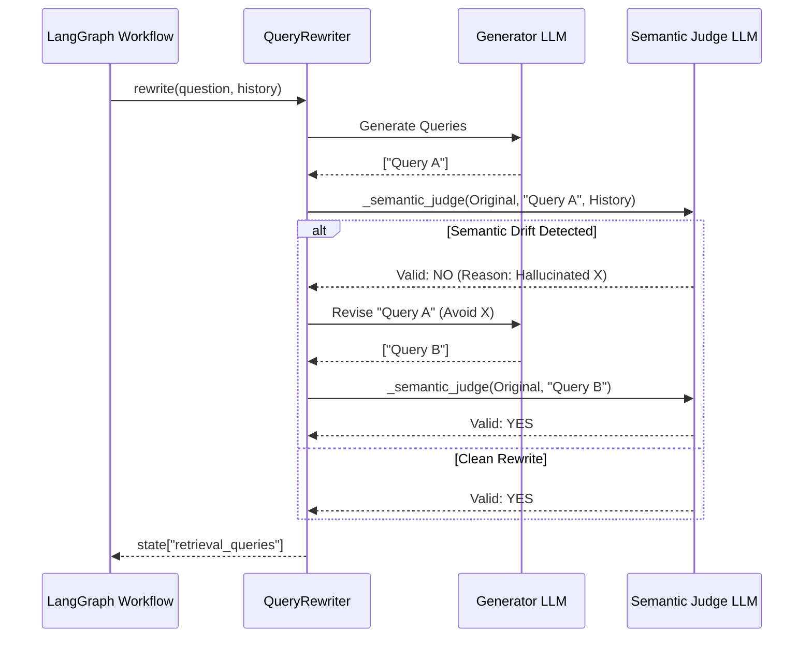

# Phase 6: Query Rewriting & The Semantic Judge

## 1. Problem Statement & Project Evolution Timeline

### Business Motivation
Users rarely ask perfect questions. A user might say "How much did it increase?" expecting the system to know "it" refers to "Q3 revenue" from three messages ago. Feeding raw user queries into a vector database results in completely irrelevant retrieval. The system must intelligently rewrite the user's query using context, and decompose complex questions into multiple search queries.

### Technical Motivation
While LLM-based query rewriting solves the core issue, it introduces a severe side effect: **Semantic Drift**. If the LLM rewrites "Who is the CEO?" into "Who is the Chief Executive Officer of OpenAI?", it adds assumptions ("OpenAI") that the user never stated, completely destroying the objective retrieval process. We needed a self-correcting loop to catch and block these hallucinations.

### Production Problem
Our initial Query Rewriter frequently hallucinated company names or technical jargon not present in the user's prompt or chat history, causing the retrieval system to pull data for the wrong company or product. 

### Architectural Goal
Implement a `QueryRewriter` agent that decomposes and expands queries. Critically, introduce a **Semantic Judge**—an internal validation loop that strictly evaluates the rewritten queries against the original user input, instantly discarding rewrites that hallucinate external entities.

### Project Evolution Timeline
- **MVP**: Sent raw user input directly to the vector database. High failure rate on conversational follow-ups.
- **V1 Rewriter**: Simple LLM prompt "Rewrite this using history". Introduced severe semantic drift and hallucinated constraints.
- **V2 Rewriter**: Added simple keyword validation. Failed on synonyms (e.g., rejected "CEO" when user typed "Chief Executive").
- **Final Production Architecture**: Implemented the "Semantic Judge". The rewriter generates drafts, and a secondary strict prompt analyzes the draft for hallucinatory constraints. Only passing queries are sent to Qdrant.

## 2. Final Adopted Architecture vs. Rejected Alternatives

### Final Adopted Architecture
- **Agent**: `QueryRewriter` (`agents/query_rewriter.py`).
- **Core Strategy**: Multi-query generation (e.g., splitting "Compare Q3 and Q4" into `["Q3 revenue", "Q4 revenue"]`).
- **Validation**: The **Semantic Judge**, implemented as `_semantic_judge()` within the agent. It returns a deterministic `{"Valid": "YES" | "NO", "Reason": "...", "Hallucinated_Entities": [...]}`.
- **Retry Logic**: If the Judge says "NO", the rewriter gets one chance to try again using the Judge's feedback.

### Rejected Alternatives
- **Keyword Overlap Thresholds**: Rejected. Checking if 80% of words in the rewrite match the original question destroyed the usefulness of the rewrite (which exists specifically to add contextual words). 
- **HyDE (Hypothetical Document Embeddings)**: Generating a fake answer and embedding it. Rejected because HyDE is notoriously prone to hallucinations when the LLM lacks latent knowledge about private enterprise documents.

## 3. Component Specifications

### `agents/query_rewriter.py` (`QueryRewriter`)
* **Responsibilities**: Take a raw user question and chat history. Output 1-3 optimized, contextually complete search queries.
* **Inputs**: `question`, `chat_history`.
* **Outputs**: List of strings `[query1, query2, ...]`.
* **Dependencies**: LLM Factory (assigned key 2), Semantic Judge logic.

### The Semantic Judge (`_semantic_judge`)
* **Responsibilities**: Prevent semantic drift. Ensure no "narrowing constraints" (like specific years or names not mentioned in context) are added.
* **Inputs**: `original_question`, `rewritten_query`, `chat_history`.
* **Outputs**: JSON containing validation status and hallucinated entities.

## 4. Detailed Implementation & Traceability

* **Rewriting Prompt**: `rewrite_prompt` instructs the LLM to output a JSON list of `queries`.
* **Evaluation Loop**:
  ```python
  rewritten_queries = self.model.invoke(rewrite_prompt)
  for query in rewritten_queries:
      judge_result = self._semantic_judge(original, query, history)
      if judge_result["Valid"] == "NO":
          # Trigger revision with feedback
          feedback = judge_result["Reason"]
  ```
* **Integration**: In `agents/workflow.py`, `_rewrite_query_step` calls `self.rewriter.rewrite()`. The output populates `state["retrieval_queries"]`.

## 5. Multi-Level Execution Sequences

### Query Rewriting Sequence (Success)
1. User: "How much did it cost?" (History: "We are building Project X").
2. Rewriter LLM generates: `"What is the cost of Project X?"`.
3. Semantic Judge evaluates: Did "Project X" come from history? YES. Did "cost" match original intent? YES.
4. Judge returns `{"Valid": "YES"}`.
5. Graph stores `["What is the cost of Project X?"]` and routes to `retrieve`.

### Query Rewriting Sequence (Semantic Drift Caught)
1. User: "What is the policy?" (History: empty).
2. Rewriter LLM hallucinates: `"What is the holiday policy for Microsoft?"`.
3. Semantic Judge evaluates: "Microsoft" and "holiday" do not exist in the prompt or history.
4. Judge returns `{"Valid": "NO", "Reason": "Added unmentioned company Microsoft"}`.
5. Rewriter takes feedback and generates: `"What is the company policy?"`.
6. Judge validates. Graph routes to `retrieve`.

## 6. Production Failure Cases & Edge Handling

* **Judge Rejection Loop**: If the Semantic Judge rejects the query and the revision also fails, the system safely falls back to using the raw `original_question` to guarantee execution doesn't halt, prioritizing a potentially poor search over a crashed thread.
* **Over-Decomposition**: The LLM might generate 10 sub-queries, destroying Qdrant limits. Handled by strict system prompt constraints: "Generate maximum 3 queries."

## 7. Mermaid Architecture Diagrams



## 8. Documentation Quality Checklist
- [x] No deprecated implementation remains.
- [x] No discussed-but-unimplemented feature is documented.
- [x] Every workflow matches the current implementation.
- [x] Every algorithm matches the implementation.
- [x] Every diagram matches the implementation.
- [x] Every execution flow is complete.
- [x] Every component interaction is documented.
- [x] Every production issue explains its resolution.
- [x] No generic enterprise filler exists.
- [x] Documentation can be understood without reading previous phases.
