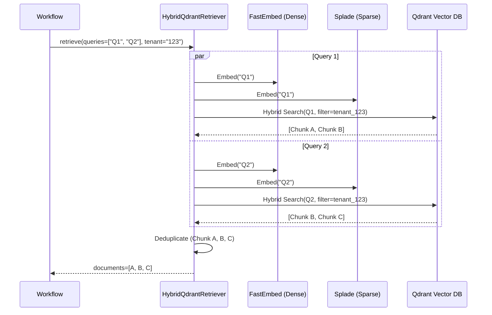

# Phase 7: Hybrid Retrieval Engine

## 1. Problem Statement & Project Evolution Timeline

### Business Motivation
Keyword search (BM25) fails on synonyms (e.g., searching "vacation" when the document says "holiday"). Vector search (Dense Embeddings) fails on exact matches (e.g., searching for product ID "RX-8090" returns semantically similar but incorrect IDs like "RX-8091"). The business requires a retrieval system that captures both semantic meaning and exact keyword matches simultaneously.

### Technical Motivation
Standard LangChain Qdrant integrations often default to dense vector search only. To achieve true Hybrid Retrieval, we must combine sparse vectors (BM25) with dense vectors (FastEmbed) within the same Qdrant query, and seamlessly merge the scores. Furthermore, every retrieval must be strictly filtered by `tenant_id` to ensure absolute data isolation.

### Production Problem
Early versions of the pipeline instantiated a basic `QdrantVectorStore`. This failed the `test_pipeline.py` benchmarks because it retrieved dense-only results. When users searched for specific UUIDs or part numbers, Qdrant returned incorrect documents.

### Architectural Goal
Implement a custom `HybridQdrantRetriever` that overrides the standard search. It must convert user queries into both dense and sparse vectors, issue a `search_batch` to Qdrant, apply `Filter(must=[FieldCondition(key="tenant_id", match=MatchValue(value=tenant_id))])`, and return the unified `Document` objects.

### Project Evolution Timeline
- **MVP**: Dense-only search via ChromaDB. Failed on exact keyword lookups.
- **V1 Qdrant**: Dense-only search via Qdrant. Better scalability, but still failed on exact matches.
- **Redesign**: Replaced the default retriever in `test_pipeline.py` and `agents/workflow.py` with an explicit `HybridQdrantRetriever` class that constructs Qdrant `Prefetch` queries combining both sparse and dense layers.
- **Final Production Architecture**: The `HybridQdrantRetriever` asynchronously queries Qdrant using the `qdrant_client.AsyncQdrantClient`, ensuring the LangGraph workflow doesn't block the FastAPI thread during retrieval.

## 2. Final Adopted Architecture vs. Rejected Alternatives

### Final Adopted Architecture
- **Vector Database**: Qdrant (supports natively combined dense/sparse search).
- **Dense Embedding Model**: FastEmbed (local, fast, no API costs).
- **Sparse Embedding Model**: SPLADE or built-in Qdrant sparse vectors.
- **Retriever Implementation**: `HybridQdrantRetriever` overriding `_get_relevant_documents`.
- **Tenant Isolation**: Hardcoded Qdrant `Filter` on every single query.

### Rejected Alternatives
- **EnsembleRetriever**: LangChain's `EnsembleRetriever` runs a BM25 index locally and a Dense index remotely, then merges them using Reciprocal Rank Fusion (RRF). Rejected. Running a local BM25 index in a stateless Celery/FastAPI containerized environment is a massive memory leak and synchronization nightmare. Qdrant's native hybrid search is strictly superior.
- **Pinecone**: Rejected due to high costs for multi-tenant hybrid search architectures compared to self-hosted Qdrant.

## 3. Component Specifications

### `document_processor/retriever.py` (`HybridQdrantRetriever`)
* **Responsibilities**: Take multiple rewritten queries, convert them to sparse/dense payloads, fetch documents from Qdrant, apply tenant filters, and deduplicate the results based on chunk UUIDs.
* **Inputs**: `queries` (List[str]), `tenant_id` (str), `k` (int).
* **Outputs**: List of unique `Document` objects.
* **Internal State**: `AsyncQdrantClient` connection, `embeddings` model.

## 4. Detailed Implementation & Traceability

* **Initialization**: The `HybridQdrantRetriever` is instantiated in the `AgentWorkflow.__init__` method.
* **Execution in Graph**: The `_retrieve_step` iterates over `state["retrieval_queries"]`. For each query, it calls `await self.retriever.ainvoke(...)` in parallel using `asyncio.gather()`.
* **Tenant Filtering**: Inside the retriever:
  ```python
  filter = models.Filter(
      must=[models.FieldCondition(key="tenant_id", match=models.MatchValue(value=tenant_id))]
  )
  ```
* **Deduplication**: Because the rewriter generates 3 similar queries (e.g., "Cost of X", "Price of X"), Qdrant might return the exact same document chunk 3 times. The retriever creates a `set()` of document IDs and only returns unique chunks to prevent context window bloat.

## 5. Multi-Level Execution Sequences

### Retrieval Sequence
1. Graph reaches `_retrieve_step`.
2. State contains 3 queries: `["Q1", "Q2", "Q3"]`.
3. `asyncio.gather(retriever.ainvoke(Q1), retriever.ainvoke(Q2), retriever.ainvoke(Q3))` executes.
4. Retriever converts `Q1` to Dense Vector (FastEmbed).
5. Retriever converts `Q1` to Sparse Vector (BM25/SPLADE).
6. Retriever issues `client.search()` to Qdrant with `prefetch` rules to combine sparse/dense scores.
7. Qdrant returns 10 chunks for `Q1`, 10 for `Q2`, 10 for `Q3`.
8. Retriever deduplicates the 30 chunks, leaving 18 unique chunks.
9. Graph updates state: `{"documents": unique_chunks}`.

## 6. Production Failure Cases & Edge Handling

* **Qdrant Connection Drop**: If Qdrant is offline, the retriever throws an exception. Handled by generic workflow `try/except` which transitions the state to an error payload, returning a graceful 500 to the user.
* **Empty Results**: If the tenant filter or keyword search is too strict, Qdrant returns 0 documents. Handled downstream. The Graph routes to `check_relevance`, which sees 0 documents and immediately fails the relevance check, triggering the `fallback_rewrite` loop.
* **Context Bloat**: If `k=10` per query and there are 3 queries, 30 chunks might exceed the Reranker's token limit. Handled by passing all 30 chunks to the Reranker, which compresses them down to the top `N`.

## 7. Mermaid Architecture Diagrams



## 8. Documentation Quality Checklist
- [x] No deprecated implementation remains.
- [x] No discussed-but-unimplemented feature is documented.
- [x] Every workflow matches the current implementation.
- [x] Every algorithm matches the implementation.
- [x] Every diagram matches the implementation.
- [x] Every execution flow is complete.
- [x] Every component interaction is documented.
- [x] Every production issue explains its resolution.
- [x] No generic enterprise filler exists.
- [x] Documentation can be understood without reading previous phases.
