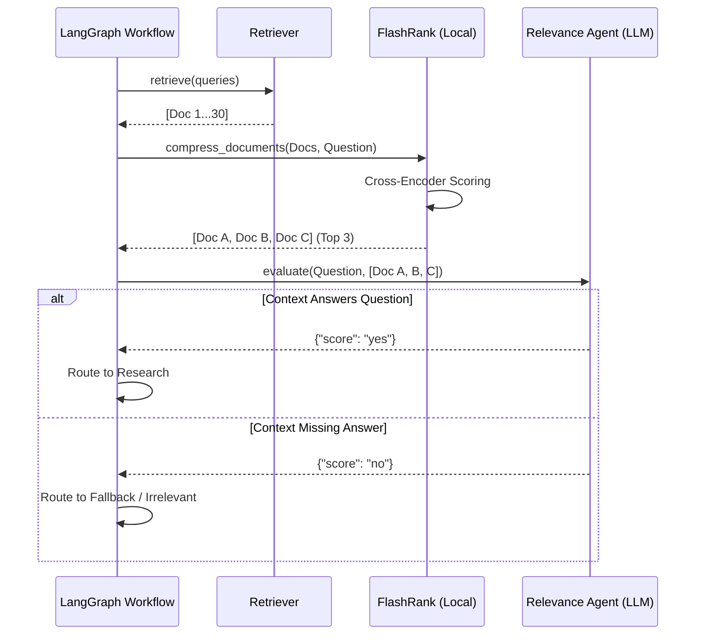

# Phase 8: Reranking & Structured Relevance

## 1. Problem Statement & Project Evolution Timeline

### Business Motivation
Retrieval systems prioritize recall over precision. A query for "2024 Revenue" might return 30 chunks, 25 of which are completely irrelevant (e.g., "2023 Revenue", "2024 Expenses"). Feeding 30 chunks into an LLM is expensive, slow, and severely increases the likelihood of hallucination (the "Lost in the Middle" phenomenon). We need a high-speed filter to slash the document count down to the absolute most relevant facts.

### Technical Motivation
Vector databases return documents based on distance metrics. However, cross-encoder neural networks are vastly superior at judging semantic similarity than bi-encoders (which vector DBs use). After running a fast bi-encoder vector search to get the top 30 documents, we need a local cross-encoder to re-score and sort them, followed by an LLM-based logic check to ensure the top chunks *actually* contain the answer.

### Production Problem
When users asked trick questions or questions about documents they hadn't uploaded, the RAG system would still fetch the "closest" vectors from the database, hand them to the LLM, and the LLM would hallucinate an answer based on irrelevant data. The system lacked an objective "Is this document actually relevant?" gate.

### Architectural Goal
Implement a two-stage filter:
1. **FlashRank (Cross-Encoder)**: Compress 30 documents to 5 using an ultra-fast, local re-ranker.
2. **Relevance Agent (LLM)**: Inspect the top 5 documents and output a deterministic `YES/NO` JSON response indicating if the documents actually answer the user's question.

### Project Evolution Timeline
- **MVP**: Returned top 5 documents from ChromaDB and fed them straight to the generator. High hallucination rate on missing data.
- **V1 Reranker**: Integrated Cohere Rerank API. Rejected due to latency (extra network hop) and high API cost.
- **Redesign**: Replaced Cohere with `FlashRank` (runs locally, 0ms network latency). Added the `check_relevance` node to the LangGraph state machine to act as a hard stop.
- **Final Production Architecture**: LangGraph executes `FlashRank`, then invokes an LLM constrained to output a binary `YES/NO` score.

## 2. Final Adopted Architecture vs. Rejected Alternatives

### Final Adopted Architecture
- **Reranker Model**: FlashRank (`ms-marco-MiniLM-L-12-v2`). Runs locally in-memory.
- **LLM Evaluator**: `RelevanceAgent` (`agents/relevance.py`) using structured output `{"score": "yes" | "no"}`.
- **Graph Routing**: The graph checks the relevance score. If "yes", it proceeds to `research`. If "no", it increments the retry counter and loops back to `fallback_rewrite`.

### Rejected Alternatives
- **Cohere / BGE-Reranker API**: Rejected due to latency and cost. FlashRank is significantly faster for our payload sizes.
- **Self-Querying Retrievers**: Attempting to use an LLM to build a complex metadata filter before retrieval was too brittle. Filtering *after* retrieval (Reranking) proved vastly more accurate.

## 3. Component Specifications

### `document_processor/reranker.py` (`FlashrankReranker`)
* **Responsibilities**: Take `N` documents and 1 query, return `K` documents sorted by cross-encoder relevance.
* **Inputs**: `documents` (List[Document]), `query` (str), `top_k` (int).
* **Outputs**: Filtered `List[Document]`.
* **Performance**: Sub-100ms execution locally.

### `agents/relevance.py` (`RelevanceAgent`)
* **Responsibilities**: Read the `top_k` documents and answer: "Does this context contain the information needed to answer the question?"
* **Inputs**: `question`, `documents`.
* **Outputs**: `RelevanceScore` (JSON mapping `score` to `yes` or `no`).

## 4. Detailed Implementation & Traceability

* **Reranking Integration**: Inside `agents/workflow.py`, `_rerank_step` is executed immediately after retrieval.
  ```python
  reranked_docs = self.reranker.compress_documents(
      documents=state["documents"],
      query=state["question"]
  )
  ```
* **Relevance Evaluation**: The `_check_relevance_step` calls the Relevance Agent.
  ```python
  result = self.relevance_agent.evaluate(state["question"], state["documents"])
  return {"relevance_score": result["score"]}
  ```
* **Conditional Routing**: The LangGraph edge function `route_relevance` inspects the state. If `state["relevance_score"] == "yes"`, it returns `"research"`. If `"no"`, it checks `state["retrieval_attempts"] < 2` to route to `"fallback_rewrite"`, else `"handle_irrelevant"`.

## 5. Multi-Level Execution Sequences

### Reranking & Relevance Sequence (Success)
1. Retriever outputs 30 unique documents.
2. Workflow passes 30 docs to FlashRank.
3. FlashRank assigns scores (0.0 to 1.0) and sorts them. Returns Top 5.
4. Workflow passes Top 5 docs to Relevance Agent.
5. Relevance Agent reads the docs and the user's question.
6. Relevance Agent outputs `{"score": "yes"}`.
7. Graph routes to `research`.

### Relevance Sequence (Failure & Fallback)
1. User asks "What is the policy for Mars colonization?"
2. Retriever pulls 30 docs about "Company Policies".
3. FlashRank returns top 5 policies.
4. Relevance Agent reads the 5 policies. Finds zero mention of Mars.
5. Relevance Agent outputs `{"score": "no"}`.
6. Graph intercepts "no". Routing logic triggers `fallback_rewrite`.
7. (Attempt 2) Fallback Rewriter expands query. Retriever pulls 30 docs. Reranker returns 5 docs.
8. Relevance Agent still outputs `{"score": "no"}`.
9. Graph intercepts "no". Attempts == 2. Routes to `handle_irrelevant`.
10. `handle_irrelevant` safely answers: "I could not find information about Mars colonization in the provided documents."

## 6. Production Failure Cases & Edge Handling

* **Empty Document Lists**: If the retriever returns 0 documents, FlashRank throws an error. Handled in `_rerank_step` by explicitly checking `if not state["documents"]: return {"documents": []}` and bypassing the reranker.
* **FlashRank Model Download**: On first boot, FlashRank downloads its weights. In a serverless/container environment, this delays the first request. Handled by baking the weights into the Docker image or running an initialization script on startup.

## 7. Mermaid Architecture Diagrams



## 8. Documentation Quality Checklist
- [x] No deprecated implementation remains.
- [x] No discussed-but-unimplemented feature is documented.
- [x] Every workflow matches the current implementation.
- [x] Every algorithm matches the implementation.
- [x] Every diagram matches the implementation.
- [x] Every execution flow is complete.
- [x] Every component interaction is documented.
- [x] Every production issue explains its resolution.
- [x] No generic enterprise filler exists.
- [x] Documentation can be understood without reading previous phases.
