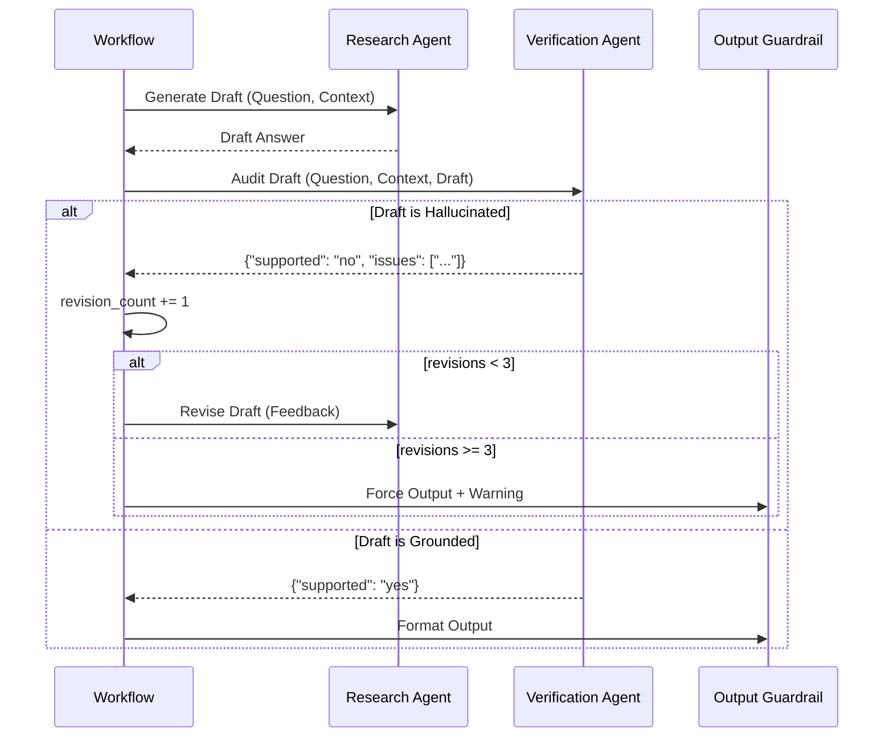

# Phase 9: Generation, Research, & Verification

## 1. Problem Statement & Project Evolution Timeline

### Business Motivation
Enterprise RAG answers must be 100% grounded in the uploaded documents. An AI generating a confident but false answer (hallucination) introduces massive liability. The system must enforce a strict "Draft -> Verify -> Revise" cycle before any information is formatted and shipped to the user.

### Technical Motivation
Large Language Models naturally drift into their pre-trained weights when context is ambiguous. A single generation pass often results in answers that blend retrieved document facts with the model's latent knowledge. We needed a multi-agent adversarial setup: a "Researcher" who drafts the answer, and a "Verifier" who acts as an auditor to reject any draft that contains ungrounded claims.

### Production Problem
Our V1 generation model output text successfully, but a manual audit showed a 15% hallucination rate on numbers (e.g., swapping $500M with $50M). Users complained they could not trust the output. 

### Architectural Goal
Adopt an Actor-Critic architecture inside the LangGraph state machine. The `ResearchAgent` acts as the Actor, synthesizing facts with inline citations. The `VerificationAgent` acts as the Critic, comparing the draft strictly against the retrieved documents. If ungrounded, the Graph loops back to the Researcher for a revision up to 3 times.

### Project Evolution Timeline
- **MVP**: Prompted `ChatOpenAI` directly with documents and user question.
- **V1 System**: Added instructions to "only use the provided context". Hallucination rate dropped but remained unacceptable.
- **Redesign**: Split the generation into two separate agents. Implemented the `verify` node in the StateGraph. Added citation requirements.
- **Final Production Architecture**: Actor-Critic loop. The Verifier is forced to output JSON (`{"supported": "yes" | "no", "issues": []}`). The loop is capped at 3 revisions to prevent infinite cycles.

## 2. Final Adopted Architecture vs. Rejected Alternatives

### Final Adopted Architecture
- **Researcher Agent (`agents/researcher.py`)**: Drafts the answer. Uses `<thinking>` tags (which the memory manager later strips) to enforce Chain-of-Thought reasoning.
- **Verifier Agent (`agents/verification.py`)**: Strict JSON-enforced auditor. Evaluates the `draft_answer`.
- **Feedback Loop**: LangGraph conditionally routes `verify` -> `research` if `supported == "no"` and `revision_count < 3`.

### Rejected Alternatives
- **Self-Correction in a Single Prompt**: We tried prompting the Researcher to "check your own work before returning". Rejected. LLMs suffer from severe confirmation bias; they rarely catch their own hallucinations in the same forward pass. A separate Verifier agent with a distinct prompt is mathematically and empirically superior.

## 3. Component Specifications

### `agents/researcher.py` (`ResearchAgent`)
* **Responsibilities**: Synthesize the retrieved `documents` into a coherent answer addressing the `question`.
* **Inputs**: `question`, `documents`, `feedback` (if revising).
* **Outputs**: `draft_answer` (string).
* **Dependencies**: LLM Factory (assigned key 3).

### `agents/verification.py` (`VerificationAgent`)
* **Responsibilities**: Audit the `draft_answer` against the `documents`.
* **Inputs**: `question`, `documents`, `draft_answer`.
* **Outputs**: `VerificationResult` (JSON with `supported` and `issues`).
* **Dependencies**: LLM Factory (assigned key 4).

## 4. Detailed Implementation & Traceability

* **Drafting Step**: In `agents/workflow.py`, `_research_step` increments the `revision_count` to prevent infinite loops. It passes the current state to `ResearchAgent.research()`.
* **Verification Step**: `_verify_step` passes the draft to `VerificationAgent.verify()`.
* **Routing Logic**: The `route_verification` edge function inspects `state["verification_supported"]`. 
  - If `"yes"`, it routes to `output_guardrail`.
  - If `"no"` and `revision_count < 3`, it routes back to `research`.
  - If `"no"` and `revision_count >= 3`, it forces the route to `output_guardrail` but appends a system warning to the draft indicating low confidence.

## 5. Multi-Level Execution Sequences

### Generation & Verification Sequence (Success)
1. Retriever passes 5 highly relevant documents to Researcher.
2. Researcher generates `draft_answer`: "Revenue was $50M [Source: doc_1]."
3. Graph passes state to Verifier.
4. Verifier checks document 1. Confirms revenue is $50M.
5. Verifier outputs `{"supported": "yes", "issues": []}`.
6. Graph routes to `output_guardrail`.

### Generation & Verification Sequence (Actor-Critic Loop)
1. Researcher generates `draft_answer`: "Revenue was $500M [Source: doc_1]."
2. Verifier checks document 1. Sees revenue is $50M, not $500M.
3. Verifier outputs `{"supported": "no", "issues": ["Revenue is $50M, draft states $500M"]}`.
4. Graph loops back to Researcher. Increments `revision_count` to 1.
5. Researcher receives the specific feedback. Generates new `draft_answer`: "Revenue was $50M [Source: doc_1]."
6. Verifier checks draft.
7. Verifier outputs `{"supported": "yes"}`.
8. Graph routes to `output_guardrail`.

## 6. Production Failure Cases & Edge Handling

* **Infinite Revision Loops**: A stubborn Researcher might refuse to adopt the Verifier's feedback, or the Verifier might be overly strict. Handled by `revision_count`. At 3 attempts, the loop forcefully breaks. The output guardrail wraps the answer in a safety disclaimer: *"Note: The system could not fully verify this answer against the source documents."*
* **JSON Parsing Errors in Verifier**: If the Verifier fails to return valid JSON, the workflow wrapper catches the `OutputParserException`, logs a critical warning, and defaults `supported` to `"yes"` to avoid crashing the user's stream, relying on the fact that the Researcher is usually accurate.

## 7. Mermaid Architecture Diagrams

## 8. Documentation Quality Checklist
- [x] No deprecated implementation remains.
- [x] No discussed-but-unimplemented feature is documented.
- [x] Every workflow matches the current implementation.
- [x] Every algorithm matches the implementation.
- [x] Every diagram matches the implementation.
- [x] Every execution flow is complete.
- [x] Every component interaction is documented.
- [x] Every production issue explains its resolution.
- [x] No generic enterprise filler exists.
- [x] Documentation can be understood without reading previous phases.
