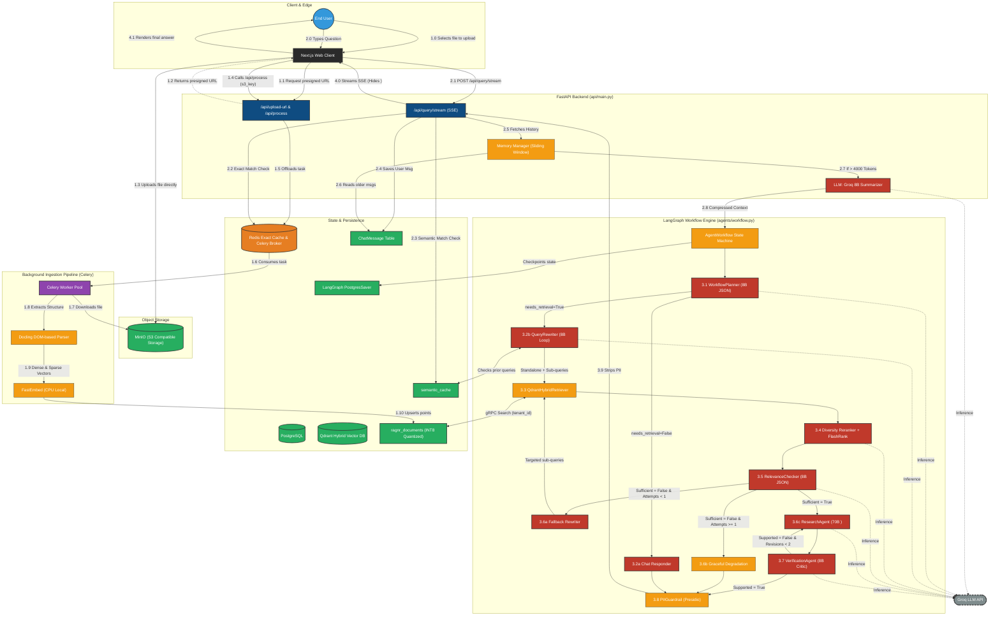

# RagnrAI Detailed System Architecture

This document contains a minute-detail architectural diagram of the `RagnrAI` production system, tracing the exact data flow of document ingestion (via MinIO) and user query execution (via SSE and LangGraph) starting explicitly from the End User interacting with the Next.js frontend.

## Architecture Diagram

## Diagram Deep Dive: Key Execution Flows

### 1.0 Document Upload & Ingestion Flow
To avoid bottling up the FastAPI server with massive file payloads, the system implements a direct-to-storage architecture using **MinIO**:
- **[1.0 - 1.1] User Interaction & Auth**: The End User selects a PDF/document. The frontend requests a presigned URL.
- **[1.2 - 1.3] Presigned Upload**: The Next.js frontend uses the URL to upload the raw document directly to the MinIO object store.
- **[1.4 - 1.5] Task Queueing**: The frontend notifies the backend by calling `/api/process`. FastAPI pushes a background task onto the **Redis** Celery broker.
- **[1.6 - 1.8] Celery Processing**: An asynchronous Celery worker pulls the task, downloads the file from MinIO, and uses **Docling** to parse the DOM structure.
- **[1.9 - 1.10] Embedding & Upsert**: The chunks are passed to **FastEmbed** locally (CPU). The resulting dense/sparse vectors are inserted into **Qdrant** via gRPC, tagged with the `tenant_id`.

### 2.0 User Query Flow & Memory Management
When an End User submits a question via the chat interface:
- **[2.0 - 2.1] API Entry**: The End User types a query into the Web Client, which POSTs to `/api/query/stream`.
- **[2.2 - 2.3] Two-Tier Cache Check**: Before doing any heavy lifting, the API checks **Redis** [2.2] for an exact match, and if that fails, checks the **Qdrant semantic cache** [2.3].
- **[2.4 - 2.6] Ledger & History**: The user's query is committed to the **PostgreSQL `ChatMessage`** table. The `MemoryManager` fetches the past chat history.
- **[2.7 - 2.8] Memory Summarization**: If the historical text exceeds 4,000 tokens [2.7], an **8B Groq Summarizer** compresses older context. The context is fed into the `AgentWorkflow` engine [2.8].

### 3.0 Orchestration Flow (LangGraph DAG)
The internal LangGraph state machine orchestrates the actual RAG process:
- **[3.1] Planner (`WorkflowPlanner`)**: Evaluates the query using a fast 8B JSON-constrained model to determine if retrieval is needed.
- **[3.2a / 3.2b] Router & Rewriter**: Routes directly to a Chat Responder [3.2a] or to the Query Rewriter [3.2b] to resolve ambiguities and split sub-queries.
- **[3.3 - 3.4] Retrieval & Reranker**: Executes a hybrid search against Qdrant [3.3]. A Diversity Reranker [3.4] enforces semantic diversity.
- **[3.5 - 3.6b] Relevance Checker & Fallback**: The Relevance Checker strictly evaluates the chunks [3.5]. If insufficient, it hits the Fallback Rewriter [3.6a]. If it continually fails, it routes to Graceful Degradation [3.6b].
- **[3.6c - 3.7] Generator & Verifier (Actor-Critic)**: The **ResearchAgent** [3.6c] generates the answer using `<thinking>` tags. The **VerificationAgent** [3.7] independently verifies the draft against the raw chunks.
- **[3.8] Guardrail**: The final generated text passes through a PIIGuardrail [3.8].

### 4.0 SSE Streaming Output
As the LangGraph DAG executes, `astream_events` emits real-time status updates:
- **[4.0] Output Streaming**: The FastAPI server streams SSE back to the UI. When `<thinking>` tags are emitted, they are suppressed and hidden from the user.
- **[4.1] Rendering**: The Next.js Web Client renders the final polished markdown for the End User.
